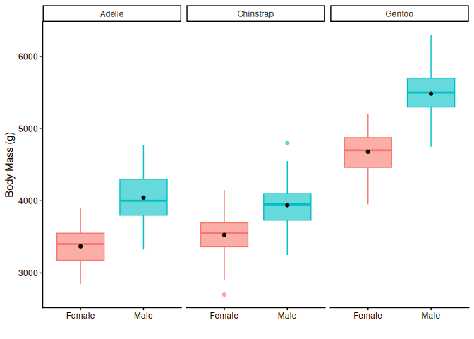
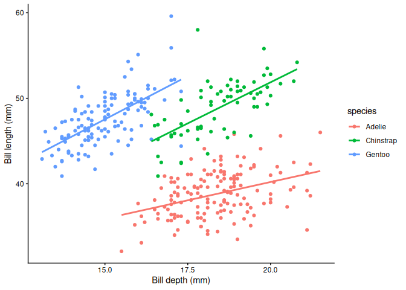
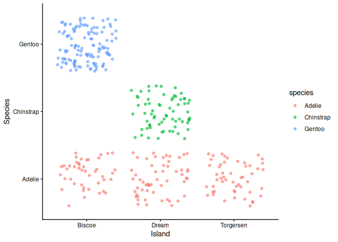
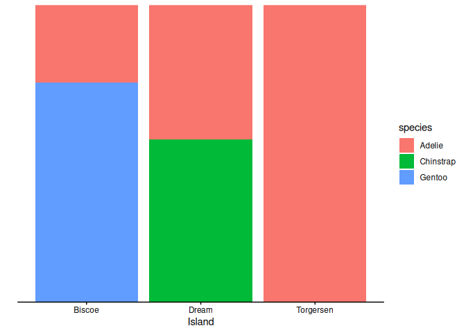

Computing Exercise 9: Penguins in R
================
Devin Gay

## Penguins innit

Source for the output in the YAML is from [How can i see output of .rmd
in
github?](https://stackoverflow.com/questions/39814916/how-can-i-see-output-of-rmd-in-github)

``` r
library(rmarkdown)
library(ggplot2)
library(palmerpenguins)
library(knitr)
```

`palmerpenguins` is derived from data collected on three species of
Antarctic penguins from three islands. The study was conducted in the
interest of collecting sex-specific foraging data. It was predicted that
all three species would exhibit sexually dimorphic feeding, only
aligning when the foraging habitat was particularly favorable.

| species | island | bill_length_mm | bill_depth_mm | flipper_length_mm | body_mass_g | sex | year |
|:---|:---|---:|---:|---:|---:|:---|---:|
| Adelie | Torgersen | 39.1 | 18.7 | 181 | 3750 | male | 2007 |
| Adelie | Torgersen | 39.5 | 17.4 | 186 | 3800 | female | 2007 |
| Adelie | Torgersen | 40.3 | 18.0 | 195 | 3250 | female | 2007 |
| Adelie | Torgersen | NA | NA | NA | NA | NA | 2007 |
| Adelie | Torgersen | 36.7 | 19.3 | 193 | 3450 | female | 2007 |
| Adelie | Torgersen | 39.3 | 20.6 | 190 | 3650 | male | 2007 |

1.  How many data columns are in ‘penguins’?

There are eight columns. dim() gives the results of nrow() and ncol().

The columns represent variables, which in this case are species, island,
bill length, bill depth, flipper length, body mass, sex, and the year of
observation

``` r
ncol(penguins)
```

    ## [1] 8

``` r
dim(penguins)
```

    ## [1] 344   8

2.  How many penguins do we have data for?

There is data for 344 penguins

``` r
nrow(penguins)
```

    ## [1] 344

3.  Do we have equal representations of males and females in the
    dataset?

There are 168 males and 165 females, this is roughly equal. The sex of
11 penguins is unknown.

Dataframes based on sex:

``` r
length(which(penguins$sex=="male")) 
```

    ## [1] 168

``` r
length(which(penguins$sex=="female")) 
```

    ## [1] 165

``` r
sum(is.na(penguins$sex))
```

    ## [1] 11

``` r
pmale <- penguins[grep("^male",penguins$sex),]
nrow(pmale)
```

    ## [1] 168

``` r
pfemale <- penguins[grep("^female",penguins$sex),]
nrow(pfemale)
```

    ## [1] 165

``` r
kable(head(pmale))
```

| species | island | bill_length_mm | bill_depth_mm | flipper_length_mm | body_mass_g | sex | year |
|:---|:---|---:|---:|---:|---:|:---|---:|
| Adelie | Torgersen | 39.1 | 18.7 | 181 | 3750 | male | 2007 |
| Adelie | Torgersen | 39.3 | 20.6 | 190 | 3650 | male | 2007 |
| Adelie | Torgersen | 39.2 | 19.6 | 195 | 4675 | male | 2007 |
| Adelie | Torgersen | 38.6 | 21.2 | 191 | 3800 | male | 2007 |
| Adelie | Torgersen | 34.6 | 21.1 | 198 | 4400 | male | 2007 |
| Adelie | Torgersen | 42.5 | 20.7 | 197 | 4500 | male | 2007 |

``` r
kable(head(pfemale))
```

| species | island | bill_length_mm | bill_depth_mm | flipper_length_mm | body_mass_g | sex | year |
|:---|:---|---:|---:|---:|---:|:---|---:|
| Adelie | Torgersen | 39.5 | 17.4 | 186 | 3800 | female | 2007 |
| Adelie | Torgersen | 40.3 | 18.0 | 195 | 3250 | female | 2007 |
| Adelie | Torgersen | 36.7 | 19.3 | 193 | 3450 | female | 2007 |
| Adelie | Torgersen | 38.9 | 17.8 | 181 | 3625 | female | 2007 |
| Adelie | Torgersen | 41.1 | 17.6 | 182 | 3200 | female | 2007 |
| Adelie | Torgersen | 36.6 | 17.8 | 185 | 3700 | female | 2007 |

4.  Do we have equal representation of each species in the dataset?

There are 152 Adelie, 68 Chinstrap, and 124 Gentoo penguins. There is
not equal representation of species

Dataframes based on species:

``` r
unique(penguins$species) # Adelie Chinstrap Gentoo
```

    ## [1] Adelie    Gentoo    Chinstrap
    ## Levels: Adelie Chinstrap Gentoo

``` r
pAdel <- penguins[grep("Adelie",penguins$species),]
nrow(pAdel) # 152
```

    ## [1] 152

``` r
pChin <- penguins[grep("Chinstrap",penguins$species),]
nrow(pChin) # 68
```

    ## [1] 68

``` r
pGen <- penguins[grep("Gentoo",penguins$species),]
nrow(pGen) # 124
```

    ## [1] 124

``` r
152+68+124 # = 344
```

    ## [1] 344

5.  Do we have equal representation of each island in the dataset?

There are 168 penguins from Biscoe island, 124 from Dream island, and 52
from Torgersen island. There is not equal representation of each island.

``` r
unique(penguins$island) # Biscoe Dream Torgersen
```

    ## [1] Torgersen Biscoe    Dream    
    ## Levels: Biscoe Dream Torgersen

``` r
iBis <- penguins[grep("Biscoe",penguins$island),]
nrow(iBis) # 168
```

    ## [1] 168

``` r
iDream <- penguins[grep("Dream",penguins$island),]
nrow(iDream) # 124
```

    ## [1] 124

``` r
iTorg <- penguins[grep("Torgersen",penguins$island),]
nrow(iTorg) # 52
```

    ## [1] 52

``` r
168+124+52
```

    ## [1] 344

## Visualization with ggplot2

1a. What measured values in the dataset most clearly distinguish male
and female penguins?

I chose body mass as a measure of sexual dimorphism. Body mass is often
a sexually dimorphic trait, and this remains largely true with these
penguins. Body mass was found to me one of the most sexually dimorphic
traits among Adelie and Gentoo penguins, but was also the least
dimorphic in Chinstraps. No trait was consistently dimorphic among all
three species, with body mass, bill length, and bill depth all being
good predictors for two of the three species, and relatively poor for
the third.

``` r
ggplot(data=subset(penguins, !is.na(penguins$sex)),aes(x=sex,y=body_mass_g)) +
geom_boxplot(data=subset(penguins, !is.na(penguins$sex)),aes(color=sex,fill=sex),alpha=.6) +
stat_summary(fun=mean,geom="point") +
theme_classic() +
scale_x_discrete(labels=c("Female","Male")) +
labs(y="Body Mass (g)",x="") +
theme(legend.position="none") +
facet_wrap(~species)
```

<!-- -->

1b. What measured values in the dataset most clearly distinguish each of
the species of penguins?

Because this is a study on feeding ecology, I chose bill length and
depth as species predictors. From the plot there is some decent
species-based clustering. Adelie penguins tend to have deeper, shorter
bills. Gentoos tend to have longer, shallower bills. Chinstraps tend to
have longer and deeper bills than the other two species.

``` r
ggplot(penguins,aes(x=bill_depth_mm,y=bill_length_mm)) +
geom_point(penguins,mapping=aes(color=species)) +
geom_smooth(method="lm",mapping=aes(color=species),se=F) +
theme_classic() +
labs(x="Bill depth (mm)",y="Bill length (mm)")
```

<!-- -->

1c. Which penguins species inhabit each of the Antarctic island sites?

I’ve never used geom_jitter() like this before, I think it’s fun.

A more familiar option is using geom_bar. position=“fill” creates
stacked bars to show proportions.

Adelie penguins are found on all three islands and are the only species
recorded on Torgersen. Gentoos are only found on Biscoe and Chinstraps
are only found on Dream island.

``` r
ggplot(penguins,aes(x=island,y=species)) +
geom_jitter(aes(color=species),alpha=0.6) +
labs(x="Island",y="Species") +
theme_classic()
```

<!-- -->

``` r
ggplot(penguins,aes(x=island,fill=species)) +
geom_bar(position="fill") +
theme_classic() +
scale_y_discrete(expand=c(0,0)) +
labs(x="Island",y="")
```

<!-- -->
